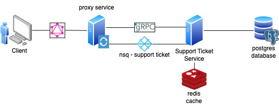

# Ticket Microservice

A Simple microservice to implement Tokopedia's tech stack. Providing API to fetch tickets, request new tickets, manage ticket status, and delete tickets.

Technology Used (Backend):
- Golang
- GraphQL
- gRPC
- NSQ
- Redis
- Postgres

Technology Used (Frontend):
- Typescript
- ReactJS - Bootstrap

## Topology

Below are the network topology for the services:

 

 Description:
 - Client: Frontend, end user.
 - Proxy service: Mapping graphql request from the frontend to call the appropriate rpc or message queue on the backend
 - Support ticket service: Managing tickets
 - Redis: Caching ticket data to reduce access to database
 - Postgres: Persistent database for storing ticket data

## Operations

### Creating new ticket flow

> GQL Contract - [CreateTicket](./docs/contract_proxyservice_CreateTicket.md)

[CLIENT] &rarr; [PROXY SERVICE] &rarr; [NSQD] &rarr; [TICKET SERVICE] &rarr; [DB] [REDIS]

- **[CLIENT]** - Execute mutation `createTicket` to **[PROXY SERVICE]**
- **[PROXY SERVICE]** - Map gql response and send create ticket message to `ticketCreate` topic to **[NSQD]**
- **[NSQD]** - Store the message in the queue until [TICKET SERVICE] consumes the message
- **[TICKET SERVICE]** - Consumes the message and store the data in **[DB]** and **[REDIS]** for 5 min

### Updating ticket status flow

> GQL Contract - [UpdateTicket](./docs/contract_proxyservice_UpdateTicket.md)

[CLIENT] &rarr; [PROXY SERVICE] &rarr; [TICKET SERVICE] &rarr; [DB]

- **[CLIENT]** - Execute mutation `createTicket` to **[PROXY SERVICE]**
- **[PROXY SERVICE]** - Map gql response and call gRPC method `CreateTicket` from **[TICKET SERVICE]** 
- **[TICKET SERVICE]** - Executes the rpc call and alter the data in **[DB]**

### Getting ticket flow

> GQL Contract - [Tickets](./docs/contract_proxyservice_GetAllTickets.md)

[CLIENT] &rarr; [PROXY SERVICE] &rarr; [TICKET SERVICE] &rarr; [REDIS] / [DB]

- **[CLIENT]** - Execute query `tickets` to **[PROXY SERVICE]**
- **[PROXY SERVICE]** - Map gql response and call gRPC method `GetTicketList` from **[TICKET SERVICE]** 
- **[TICKET SERVICE]** - Executes the rpc call and check if data exist in **[REDIS]**
  - if EXIST - Return the data in **[REDIS]**
  - if NOT EXIST - Fetch the data from **[DB]**

### Deleting ticket flow

> GQL Contract - [DeleteTicket](./docs/contract_proxyservice_DeleteTicket.md)

- **[CLIENT]** - Execute mutation `deleteTicket` to **[PROXY SERVICE]**
- **[PROXY SERVICE]** - Map gql response and call gRPC method `DeleteTicket` from **[TICKET SERVICE]** 
- **[TICKET SERVICE]** - Executes the rpc call and deletes the data in **[DB]**

## Database Schema

| Field       | Type                  |
| ----------- | --------------------- |
| id          | integer (PRIMARY KEY) |
| title       | string                |
| description | string                |
| status      | string                |
| name        | string                |

## Appendix

- [22/11/2023 - 29/11/2023] : Developing with dependency injection (as per campaign's docs) - Failed due to lots of abstractions
- [30/11/2023 - 04/11/2023] : Developing with 'as-long-as-it-works' paradign - Backend 100% and Frontend 60% (not yet integrated)

### Planned features
- [x] Makefile for mundane tasks (running, generate proto, generate gql)
- [x] One repo for everything - working with go.work
- [ ] Dockerize the whole application (one docker-compose to launch) - **80%** (missing tweaks)
- [ ] Detailed docs - **85%** (missing gRPC docs)

### Issues:
- Underestimating project complexity